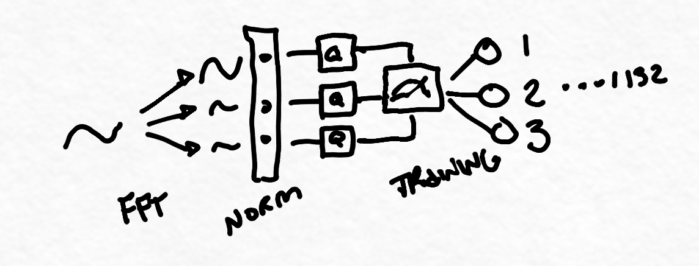

# geflo

## Concept

geflo is a project that aims to classify fNIRS data streams from a brain computer interface device. currently the project is a work in progress, and contains the ability to stream the data into a file, and read back to be classifed with 61% accuracy based on 3 categories.

geflo is a program & cli to aid those in decentralized cognitive research. It consists of 2 main components:

Model: a multi class variational classifier to categorize fNIRS brain headset data from 3 different session variants
Market: saves the weights to be transferred to perform model tuning on additional private datasets, a type of transfer learning
The cli gives a user the ability to interact with models by purchasing those that are pre-trained from a market stored on the blockchain, possibly mix in pricing in the future.

With these 2 pieces: computation & parameter sharing, the hope is that this pipeline can be applied to various different use cases that require a pre-trained model of cognitive data (e.g. chemistry, etc.)




## Cli application
A cli application that allows a user to choose a model to transfer learn from.

```
$ python checkout vanes
> model #1 -- $20
> model #2 -- $30 <
> model #3 -- $40
```


### select_pod.py blueberry pod discover 
[blueberry][blueberry_link].

[blueberry_link]: https://www.blueberryx.com
```
search nearby devices
find mac address/device address for data_pipe.py
```

### data_pipe.py convert data into fft energy bins and save
```
logs all data to csvs
does buffer based conversion
```
